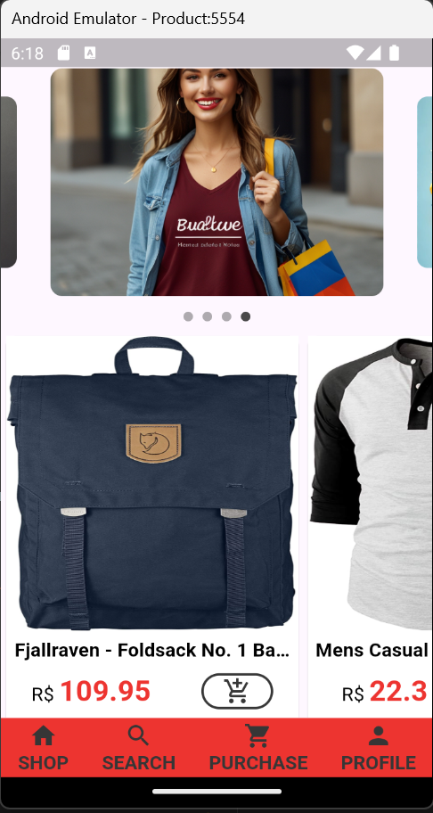
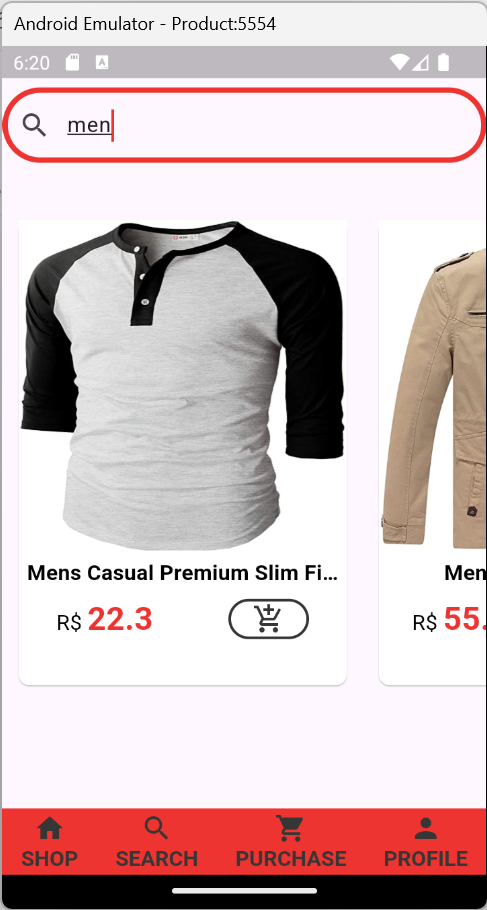
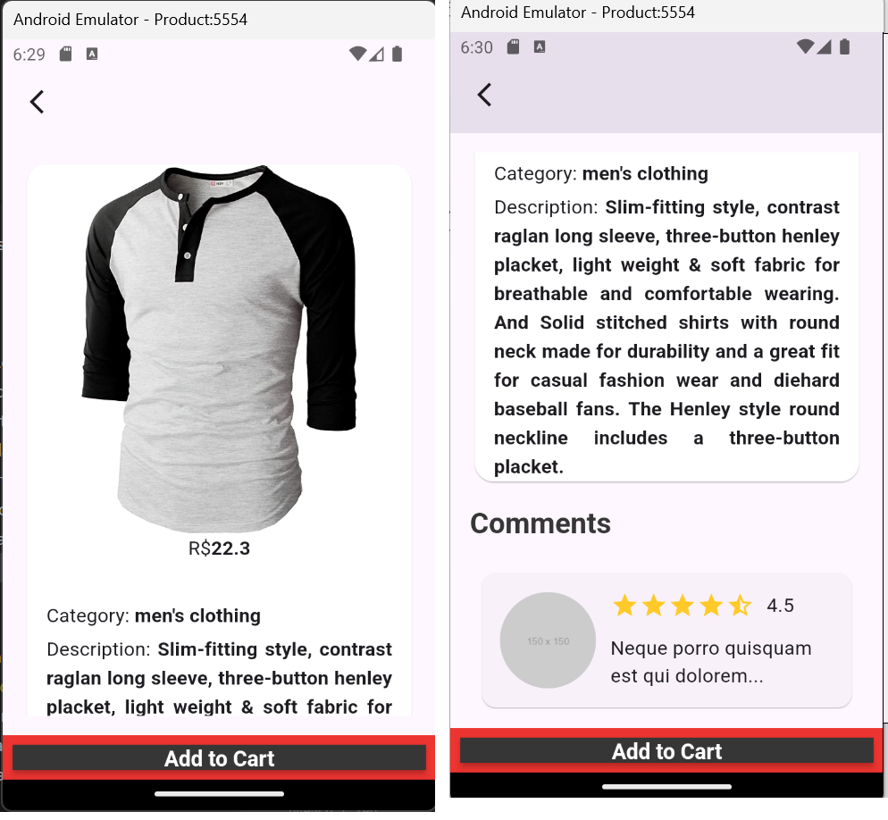
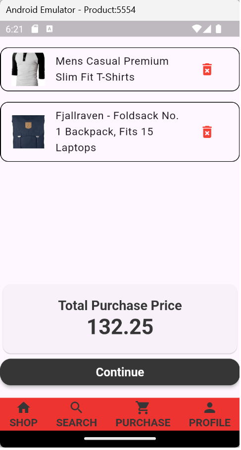
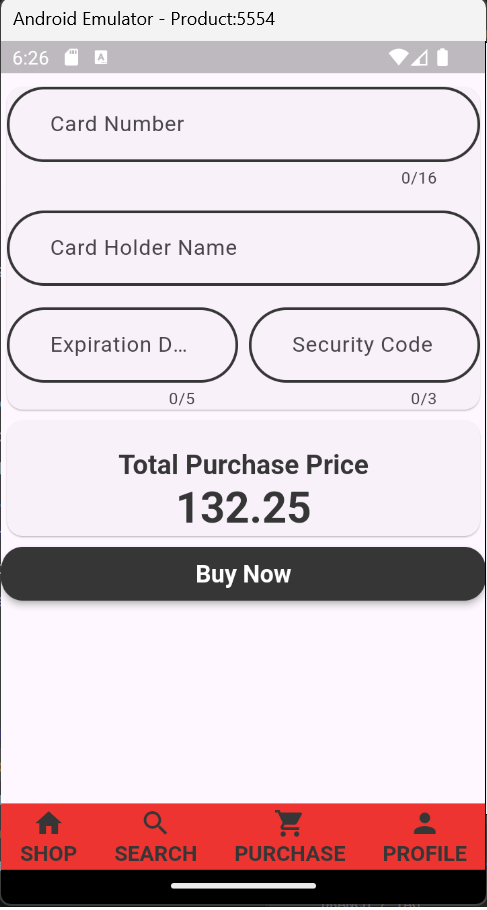

# Fake Shopping App

A Flutter project in development.

## Description

Welcome to the Fake Shopping App! This application is designed to make it easy to purchase a variety of products. With a friendly and intuitive interface, you can explore our catalog, select your favorite products, and place orders directly through the app.

## Features

- **Authentication**: Provides authentication using Firebase, including login with email and password, logout and new user registration.

- **Product Listing**: Display a responsive, paginated product catalog, dynamically fetching items from a free APi.

- **Product Search**: Integrates a real-time, keyword-based search functionality to help users quickly locate products.

- **Cart Management**: Enables adding and removing items from the shopping cart, with instant visual feedback on item quantities and subtotal calculations.

- **Credit Card Payment Formt**: Provides a credit card payment form with validation.

- **Bottom Navigation Bar**: A responsive navigation bar, enabling quick access to core sections like Home, Cart, and Profile..

- **Profile Drawer**: A simple customizable profile drawer with account details and logout.

- **Features in development**
Recover Password
Register new user with image 

## Technical informations

Fetch Datas from free Api: https://fakestoreapi.com,
Firebase,
Internationalizing,
Custom Wigets,
Layout,
State Management with Hook,
Cubit,
Navigation,
Test Units,

## Pictures

<table>
  <tr>
    <td></td>
    <td></td>
    <td></td>
  </tr>
  <tr>
    <td></td>
    <td></td>
    <td></td>
  </tr>
</table>
